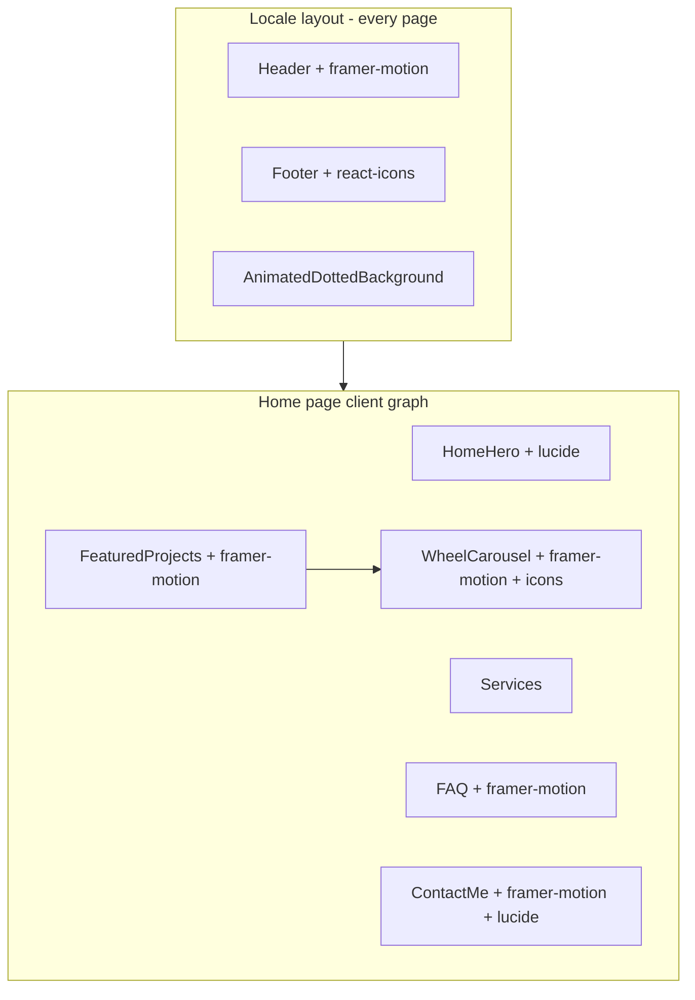

# Bundle analysis and code-splitting plan

## Current state

| Area | Finding |
|------|---------|
| Build | [`package.json`](package.json) uses `"build": "next build --turbopack"` — Turbopack prod builds produce different chunk graphs than webpack; your named chunks (`68f640eb9a5f7057.js`, `a4ec1be41831e682.js`) are almost certainly from a **webpack** (or hosted) build, not reproducible until `--turbo` is removed from `build`. |
| Analyzer | `@next/bundle-analyzer` is **not** installed; [`next.config.ts`](next.config.ts) has no analyzer wrapper. |
| Home initial JS | [`app/[locale]/page.tsx`](app/[locale]/page.tsx) statically imports six client sections (`HomeHero`, `Services`, `FeaturedProjects`, `TrustedBy`, `FAQ`, `ContactMe`) plus `ThemeToggle` / `PageTheme`. |
| Layout (every page) | [`app/[locale]/layout.tsx`](app/[locale]/layout.tsx) always loads `Header` (framer-motion), `Footer` (react-icons), `AnimatedDottedBackground`, `SpeedInsights`. |
| Heavy libs | **framer-motion** is imported in 7+ client files; **WheelCarousel** (~600 lines + motion + `react-icons`) is the heaviest widget. **googleapis** is server-only via [`lib/googleSheets.ts`](lib/googleSheets.ts) — should **not** appear in client bundles (verify in analyzer). |



---

## Phase 1 — Tooling and production build fix

### 1.1 Install and wire bundle analyzer

- Add devDependency: `@next/bundle-analyzer`
- Update [`next.config.ts`](next.config.ts):

```ts
import bundleAnalyzer from '@next/bundle-analyzer';

const withBundleAnalyzer = bundleAnalyzer({
  enabled: process.env.ANALYZE === 'true',
});

export default withBundleAnalyzer(withNextIntl(nextConfig));
```

- Add scripts to [`package.json`](package.json):
  - `"build": "next build"` (remove `--turbo`)
  - Keep `"dev": "next dev --turbopack"` (dev-only Turbopack is fine)
  - `"analyze": "cross-env ANALYZE=true next build"` — add `cross-env` devDep so `ANALYZE` works on Windows PowerShell

### 1.2 Run analysis (after plan approval)

```bash
pnpm add -D @next/bundle-analyzer cross-env
pnpm analyze
```

- Opens two HTML reports (`client.html`, `server.html` in `.next/analyze/` depending on version).
- In the **client** treemap, search for modules inside the large hashed files (`68f640eb…`, `a4ec1be…`). Expect likely contents:
  - **framer-motion** (+ motion-dom) shared across Header / FAQ / Contact / FeaturedProjects / WheelCarousel
  - **react-icons** (fa/md subsets)
  - **lucide-react** (HomeHero, ContactMe, ThemeToggle)
  - Possibly **Next.js runtime** / **next-intl** client chunks (framework — do not dynamic-import)

Chunk hashes **change every build**; use the analyzer module tree, not filenames alone.

### 1.3 Post-analyze checklist

- Confirm `googleapis` appears only under **server** bundles.
- Note parsed size of `framer-motion`, `WheelCarousel`, `ContactMe`, `FeaturedProjects`.
- Compare **First Load JS** for `/[locale]` before vs after splits (Next build output table).

---

## Phase 2 — Code-splitting with `next/dynamic`

Strategy: keep above-the-fold / layout-critical UI eager; defer below-the-fold and interaction-heavy widgets. Use `ssr: false` only when the component depends on `window`, drag/gesture APIs, or would cause hydration mismatch — not for every section.

### 2.1 Home page — [`app/[locale]/page.tsx`](app/[locale]/page.tsx)

**Keep static (initial render):**

- `PageTheme`, `ThemeToggle`, `HomeHero`

**Convert to `dynamic()` imports (new async chunks):**

| Component | Rationale | `ssr` |
|-----------|-----------|-------|
| `FeaturedProjects` | Portfolio block; pulls framer-motion + `WheelCarousel` | default `true` OK; optional `loading` skeleton |
| `WheelCarousel` (nested) | Heaviest carousel/gestures | `ssr: false` inside `FeaturedProjects.tsx` |
| `FAQ` | Accordion animations; below fold | default |
| `ContactMe` | Large form + AnimatePresence | default |
| `TrustedBy` | Below fold | default |
| `Services` | Below hero on most viewports | default (or defer if analyzer shows it in top chunk) |

Example pattern for the page (server component):

```tsx
import dynamic from 'next/dynamic';

const FeaturedProjects = dynamic(
  () => import('@/components/blocks/projects/FeaturedProjects'),
  { loading: () => <section id="portfolio" aria-busy className="min-h-[480px]" /> }
);
```

### 2.2 Nested split — [`components/blocks/projects/FeaturedProjects.tsx`](components/blocks/projects/FeaturedProjects.tsx)

```tsx
const WheelCarousel = dynamic(() => import('./WheelCarousel'), {
  ssr: false,
  loading: () => <div className={styles.carouselPlaceholder} aria-hidden />,
});
```

This isolates pan/gesture + image carousel JS from the category nav shell.

### 2.3 Layout — optional smaller wins — [`app/[locale]/layout.tsx`](app/[locale]/layout.tsx)

| Component | Action |
|-----------|--------|
| `SpeedInsights` | `dynamic(() => import('@vercel/speed-insights/next').then(m => ({ default: m.SpeedInsights })), { ssr: false })` — analytics, not needed for first paint |
| `Header` mobile drawer | If analyzer shows Header in a top chunk: extract mobile menu panel to `HeaderMobileMenu.tsx` and `dynamic(..., { ssr: false })` loaded only when `isMenuOpen` (bigger refactor; do if Header chunk is still large after home splits) |

Keep `Footer` and core `Header` shell eager (navigation must work immediately).

### 2.4 Other routes (lower priority)

- [`app/[locale]/blog/[slug]/page.tsx`](app/[locale]/blog/[slug]/page.tsx): `react-markdown` runs in a **Server Component** today — good; no client split needed unless you move markdown to a client wrapper.
- [`app/[locale]/about/page.tsx`](app/[locale]/about/page.tsx): only `AboutHero` — small; no change unless analyzer flags it.

### 2.5 Small cleanup while touching files

- Remove debug `console.log` in [`components/blocks/services/Services.tsx`](components/blocks/services/Services.tsx) (line 14).

---

## Phase 3 — Unused dependencies (safe to remove)

Verified **no imports** in `app/`, `components/`, `lib/` (excluding `_backups/`):

| Package | Status |
|---------|--------|
| `html2canvas` | Unused (likely leftover from removed price estimator in `_backups/`) |
| `jspdf` | Unused |
| `react-hook-form` | Unused |
| `zod` | Unused |

**Keep:** `googleapis`, `gray-matter`, `framer-motion`, `react-markdown`, `lucide-react`, `react-icons`, `@vercel/speed-insights`, `next-intl`.

**DevDependency candidate:** `@svgr/webpack` — listed in [`package.json`](package.json) but **not** referenced in [`next.config.ts`](next.config.ts) or webpack rules; safe to remove unless you plan SVG-as-component imports.

**Optional dead code** (not in `package.json`, but reduces confusion):

- [`components/ui/LocaleSwitcher.tsx`](components/ui/LocaleSwitcher.tsx) — not imported anywhere
- [`components/blog/post/BlogPost.tsx`](components/blog/post/BlogPost.tsx) — unused; blog slug page inlines `Markdown`

Removal command after approval:

```bash
pnpm remove html2canvas jspdf react-hook-form zod
pnpm remove -D @svgr/webpack   # if confirmed unused
```

---

## Phase 4 — Verification

1. `pnpm build` — succeeds **without** `--turbo`
2. `pnpm analyze` — confirm smaller main/home client chunk; `WheelCarousel` / `framer-motion` in separate async chunks
3. Manual smoke: home scroll, portfolio carousel drag, FAQ accordion, contact form submit, header mobile menu, `/en/blog/[slug]`
4. Optional: `pnpm test:unit` + `pnpm test:e2e` if Playwright covers home interactions

---

## Expected outcome

- Production builds use **webpack** bundling consistent with analyzer and typical hosting.
- Home **First Load JS** drops by deferring framer-motion-heavy sections (especially `FeaturedProjects` / `WheelCarousel`, `FAQ`, `ContactMe`).
- ~4 unused runtime deps removed (~hundreds of KB from `node_modules`, cleaner installs).
- Named chunk files will get **new hashes** after splits; use analyzer treemaps for future regressions.
