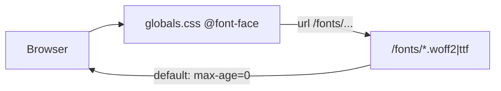

# Font long-term caching plan

## Current state

| Item | Detail |
|------|--------|
| Location | All font binaries are already under [`public/fonts/`](public/fonts/) (Vazirmatn `.woff2`, English families under `public/fonts/english/`). |
| Loading | [`app/globals.css`](app/globals.css) defines 11 `@font-face` rules pointing at `/fonts/...` (no fingerprint). [`styles/tokens/tokens.css`](styles/tokens/tokens.css) duplicates Big Shoulders once (different `font-family` / weight — consolidate). |
| `next/font` | Google `next/font` imports are commented out in [`app/layout.tsx`](app/layout.tsx); self-hosted CSS path is the active approach. |
| Headers | [`next.config.ts`](next.config.ts) has no `headers()`; no [`vercel.json`](vercel.json). |
| Why HAR shows `max-age=0` | Next.js documents that files in `public/` are **not** fingerprinted and get `Cache-Control: public, max-age=0` (often with `must-revalidate`) so browsers revalidate every time. |



**Linux deploy note:** CSS references `/fonts/english/inter/` (lowercase) but the folder on disk is `public/fonts/english/Inter/`. Works on Windows; rename folder to `inter` (or update CSS) before production.

**Repo note:** Only `public/fonts/Vazirmatn/OFL.txt` appears tracked in git; binary fonts exist locally. Ensure font files are committed (or documented) so Vercel builds can serve them.

---

## Recommended approach (matches your request)

Use **both**:

1. **Cache-bust fingerprint** on every font URL (query param — simplest with existing `@font-face` in CSS).
2. **Long-cache headers** for font paths via `next.config.ts` **and** `vercel.json` (Vercel is your host; platform headers are the most reliable override for `public/` assets).

Do **not** use `immutable` without a fingerprint: if filenames stay `Poppins-Regular.ttf` forever, browsers will never pick up a replaced file after deploy.

### 1. Build-time font version constant

Add a single version string injected at build time (git short SHA or manual bump when font files change):

- In [`package.json`](package.json) scripts, prefix build with env, e.g. `cross-env NEXT_PUBLIC_FONT_ASSET_VERSION=%npm_package_version%` (or `git rev-parse --short HEAD` in CI).
- In [`app/globals.css`](app/globals.css), reference via CSS variable set once at the top:

```css
:root {
  --font-asset-version: "BUILD_ID_PLACEHOLDER";
}
/* then in each @font-face: */
src: url("/fonts/Vazirmatn/Vazirmatn-Arabic-400.woff2?v=BUILD_ID_PLACEHOLDER") format("woff2");
```

Because raw CSS cannot read `process.env`, use one of these (pick **A** for minimal churn):

- **A (recommended):** Small generated file `styles/font-asset-version.css` written by a `prebuild` script (`node scripts/font-asset-version.mjs`) that emits `--font-asset-version: "<sha>";` and is imported from `globals.css` before `@font-face` blocks. Each `src` uses `url("...woff2?v=" var(--font-asset-version))` — **invalid in CSS**; instead append the version literally in generated `@font-face` blocks, or use a PostCSS/Tailwind plugin. **Simplest working pattern:** generate the version into a tiny CSS file and duplicate only the query string via search-replace in the prebuild script that rewrites `globals.css` font URLs — **cleaner:** move all `@font-face` rules into `styles/fonts.css` and have the script regenerate that file from a template with `{{FONT_VERSION}}`.

- **B:** Physical hashed filenames (e.g. `Poppins-Regular.a1b2c3d4.woff2`) via the same prebuild script copying/renaming in `public/fonts/` and rewriting paths — matches your filename example but more moving parts.

**Practical minimal diff (A simplified):** Add `styles/fonts.css` containing all `@font-face` rules with placeholder `__FONT_VERSION__`. Prebuild script replaces `__FONT_VERSION__` with `process.env.NEXT_PUBLIC_FONT_ASSET_VERSION || 'dev'`. Import `styles/fonts.css` from [`app/[locale]/layout.tsx`](app/[locale]/layout.tsx) (or `globals.css`) and remove duplicate faces from `globals.css` / [`styles/tokens/tokens.css`](styles/tokens/tokens.css).

Example URL after build:

`/fonts/english/anton-sc/BebasNeue-Regular.ttf?v=a1b2c3d4`

### 2. `next.config.ts` headers (production only)

Extend [`next.config.ts`](next.config.ts) (project uses `.ts`, not `.js`):

```ts
async headers() {
  if (process.env.NODE_ENV !== 'production') return [];
  return [
    {
      source: '/fonts/:path*',
      headers: [
        {
          key: 'Cache-Control',
          value: 'public, max-age=31536000, immutable',
        },
      ],
    },
  ];
},
```

Optionally narrow with a regex source for extensions only (`woff2`, `woff`, `ttf`, `otf`) if you later add non-font files under `/fonts/`.

Verify locally after `pnpm build && pnpm start` with DevTools → Network → a `.woff2` request.

### 3. `vercel.json` (Vercel deployment)

Add [`vercel.json`](vercel.json) at repo root so edge caching matches intent even if Next’s static handler behavior varies:

```json
{
  "headers": [
    {
      "source": "/fonts/(.*\\.(?:woff2|woff|ttf|otf))",
      "headers": [
        {
          "key": "Cache-Control",
          "value": "public, max-age=31536000, immutable"
        }
      ]
    }
  ]
}
```

After deploy, confirm in HAR: `Cache-Control: public, max-age=31536000, immutable` on `/fonts/...` responses.

### 4. Consolidate and fix font definitions

- **Remove** duplicate `@font-face` from [`styles/tokens/tokens.css`](styles/tokens/tokens.css) (lines 2–7); keep a single definition in the centralized `styles/fonts.css`.
- **Rename** `public/fonts/english/Inter` → `public/fonts/english/inter` to match CSS (case-sensitive on Vercel/Linux).
- **Optional cleanup (out of scope unless you want it):** Many unused weights exist under `big-shoulders/` and `poppins/`; only the files referenced in CSS need to ship.

### 5. What we are not doing (unless you ask later)

| Alternative | Why deferred |
|-------------|----------------|
| `next/font/local` + static import | Moves fonts to `_next/static/media/<hash>.woff2` with automatic immutable caching, but **does not** keep URLs under `/public/fonts/` as you requested. Good follow-up if you want to drop manual `@font-face` entirely. |
| Convert all `.ttf` → `.woff2` | Smaller downloads; separate perf task. |
| Query-only without `immutable` | Would allow revalidation but misses your immutable goal. |

---

## Verification checklist

1. `pnpm build && pnpm start` → load `/fa` or `/en` → Network tab shows font requests with `?v=<version>` and `Cache-Control` including `max-age=31536000` and `immutable`.
2. Deploy preview on Vercel → repeat HAR check on production URL.
3. Bump `NEXT_PUBLIC_FONT_ASSET_VERSION` (or change font file) → new `?v=` → browser fetches fresh file; old cache entries are orphaned (safe with immutable).

---

## Files to touch

| File | Change |
|------|--------|
| [`next.config.ts`](next.config.ts) | Add `headers()` for `/fonts/:path*` |
| `vercel.json` (new) | Font cache headers for Vercel edge |
| `scripts/font-asset-version.mjs` (new) | Emit version / rewrite `styles/fonts.css` |
| `styles/fonts.css` (new) | All `@font-face` rules with `?v=__FONT_VERSION__` |
| [`app/globals.css`](app/globals.css) | Remove `@font-face` blocks; import `fonts.css` |
| [`styles/tokens/tokens.css`](styles/tokens/tokens.css) | Remove duplicate `@font-face` |
| [`package.json`](package.json) | `prebuild` script + env on `build` / `analyze` |
| `public/fonts/english/Inter/` | Rename to `inter/` |
